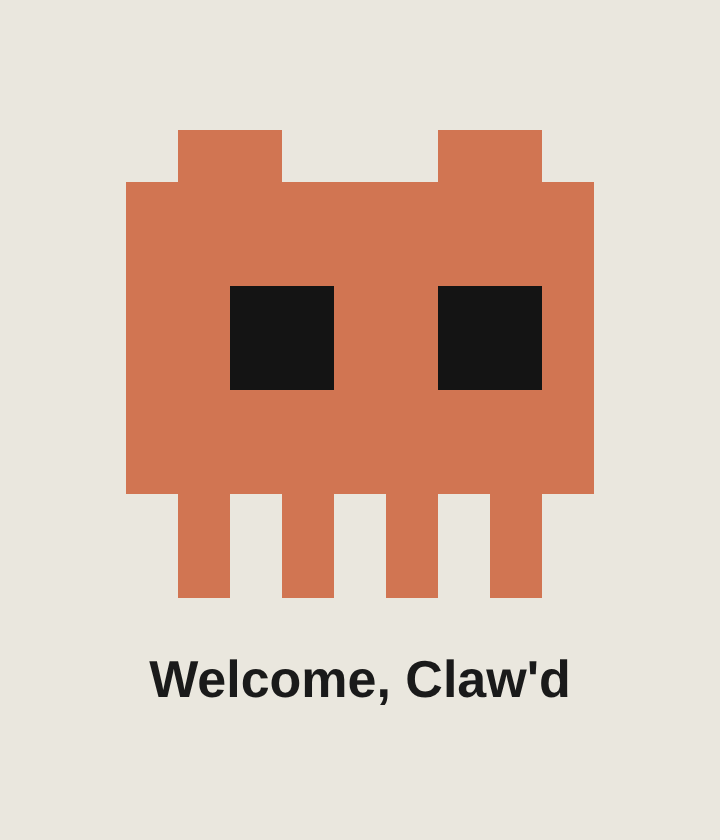
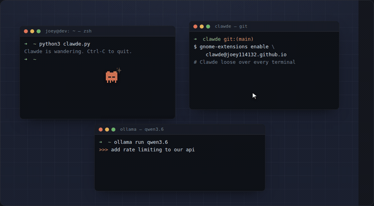

<h1 align="center">clawde 🧡</h1>

<p align="center"><b>a tiny pixel Claude that lives in your terminals.</b></p>

<p align="center">
  <a href="https://github.com/joey114132/clawde/releases/latest"></a>
  <a href="https://joey114132.github.io/clawde/"></a>
  
</p>

<p align="center">
  
</p>

<p align="center">
  he wanders the edges of your terminal windows · portals between them ·<br>
  shows his feelings · dances when the mood strikes · and drops the odd meme.
</p>

<p align="center">
  <a href="https://joey114132.github.io/clawde/"></a>
</p>
<p align="center"><a href="https://joey114132.github.io/clawde/">▶ <b>play with the live demo</b></a></p>

---

## 🚀 install in one line

Each command downloads the app, installs it, and Clawde starts wandering right away —
and comes back every time you log in. 🎉

**macOS**
```bash
curl -fsSL https://raw.githubusercontent.com/joey114132/clawde/main/install.sh | bash
```

**Linux**
```bash
curl -fsSL https://raw.githubusercontent.com/joey114132/clawde/main/install.sh | bash
```

**Windows** — in PowerShell:
```powershell
irm https://raw.githubusercontent.com/joey114132/clawde/main/install.ps1 | iex
```

> **Needs `curl`** (mac & Linux only). It's **pre-installed on macOS** — nothing to do.
> On a minimal Linux box, install it first if it's missing:
> `sudo apt install curl` (Debian/Ubuntu) · `sudo dnf install curl` (Fedora) · `sudo pacman -S curl` (Arch).
> The **Windows** line uses PowerShell's built-in `irm`, so **no curl needed** there.
>
> Not code-signed yet → the first launch shows a "run anyway / open" prompt. Prefer to
> click instead of curl? See [install](#install-) for the download-from-Releases steps.

## meet clawde

Clawde is a desktop mascot that hangs out *inside* your terminals while you code.
He is not useful. That is entirely the point — he's just here to keep you company. 🐾

- 🚶 **wanders** the blank margin of a terminal window, with a shuffling, never-quite-the-same gait
- 🌀 **portals** to another terminal every few seconds
- 🎭 **has feelings** — happy, sleepy, dizzy, curious, head-over-heels in love, and more
- 🕺 **dances** entirely unprompted
- 💀 **memes** — "this is fine", "stonks 📈", "404: nap not found"
- 👆 **reacts** when you poke him — gently, or... rather less gently

## ways to run him

| where | runs on | what he does |
|---|---|---|
| 🖥️ **GNOME Shell** — [`gnome-extension/`](gnome-extension/) | Linux · GNOME | roams over **every** terminal, tab, and app across your whole desktop |
| 💻 **Desktop app** — [`electron-app/`](electron-app/) | **Windows · macOS** · Linux | the same "over everything" pet for Win/Mac — wanders your whole screen, **auto-starts at login** |
| 🐍 **Terminal** — [`clawde.py`](clawde.py) | Windows · macOS · Linux | a pure-Python Clawde in one terminal pane, zero deps, any shell |
| 🧩 **VS Code** — [`vscode-extension/`](vscode-extension/) | Windows · macOS · Linux | Clawde in a little panel beside your code |

> **Want him roaming over *everything*?** On Linux that's the **GNOME extension** (runs
> inside the compositor). On **Windows / macOS** it's the **desktop app** — download the
> installer, run it once, and Clawde auto-appears at every login. Same pet, different
> wrapper, because Win/Mac have no shell-extension model.

## install 📦

### 💻 Windows & macOS — the desktop pet (recommended)

The full "over everything" Clawde: download once, and he wanders your whole screen at
every login — no terminal, no python.

1. Open the **[latest release](https://github.com/joey114132/clawde/releases/latest)** and
   download the file for your OS:
   - **Windows** → `Clawde-Setup-*.exe`
   - **macOS** (Intel & Apple Silicon) → `Clawde-*-universal.dmg`
2. Run it:
   - **Windows** — double-click the `.exe`. SmartScreen may warn *"unknown publisher"* (it's
     not code-signed yet) → click **More info → Run anyway**.
   - **macOS** — open the `.dmg`, drag **Clawde** into **Applications**, then the *first* time
     **right-click Clawde → Open** (a plain double-click is blocked for unsigned apps) → **Open**.
3. Clawde starts wandering. He lives in the **system tray** (Windows) / **menu bar** (macOS) 🧡 —
   click it for **Start at login** (on by default) and **Quit**.

Done. He now appears on his own every time you log in.

### 🖥️ Linux — the GNOME Shell extension

One line — downloads, installs, and pre-enables him:

```bash
curl -fsSL https://raw.githubusercontent.com/joey114132/clawde/main/web-install.sh | bash
```

Then **log out and back in** — Clawde appears on his own. Turn him off with
`gnome-extensions disable clawde@joey114132.github.io`.
*(Prefer the desktop app on Linux too? Grab the `.AppImage` from the [releases](https://github.com/joey114132/clawde/releases/latest). A one-click [extensions.gnome.org](https://extensions.gnome.org) listing is the goal — Snap can't host a Shell extension, so it isn't an option.)*

<details><summary>install from a clone instead</summary>

```bash
git clone https://github.com/joey114132/clawde
cd clawde/gnome-extension && ./install.sh   # then log out / back in
```
</details>

### 🐍 Any OS — the terminal one (no install)

```bash
python3 clawde.py     # macOS / Linux — any shell (zsh, bash, fish)
py clawde.py          # Windows — PowerShell or cmd
```

Python 3.8+, zero dependencies, runs from any shell. On Windows he auto-enables VT so the
ANSI renders (Windows Terminal recommended). **Ctrl-C** sends him home — he draws to the
alternate screen, so your scrollback stays untouched.

### 🧩 VS Code — the panel

Open [`vscode-extension/`](vscode-extension/) in VS Code and press **F5**, or package it
with `vsce`. A Clawde wanders in a panel beside your code.

## how clawde feels 🎭

`happy ✨` · `love ❤️` · `sleepy 💤` · `dizzy 😵` · `curious ❓` · `surprised ❗` ·
`cool 😎` · `sad 💧` — plus a few meme faces (`🗿` `💀` `👀`) for when words fail.

## the honest bits 📎

- The GNOME extension targets **GNOME 46** (ESM). If Clawde doesn't appear after enabling,
  peek at `journalctl --user -b | grep -i clawde` — and open an issue. 🙏
- A terminal script genuinely **can't** cross tabs or windows (each is its own pseudo-terminal).
  That's *why* the "over everything" version has to be a Shell extension — a Wayland fact,
  not a missing feature.
- VS Code sandboxes its extensions, so that Clawde politely stays in his panel.
- **Terminator splits:** by default Clawde sees a split Terminator window as one space
  (the compositor can't see inside it). Install the [Terminator plugin](terminator-plugin/)
  and he'll wander + teleport between the individual **split panes** too.
- The Windows/macOS desktop app isn't code-signed yet — first launch shows an
  "unknown publisher / unidentified developer" prompt. Choose *Run anyway* / *Open*.

## roadmap 🗺️

- [x] website leaderboard — nickname + Supabase ([enable it](LEADERBOARD.md))
- [x] run *away* from your cursor (oneko-style)
- [ ] richer sprite art & more little animations
- [ ] preferences — speed, size, which monitor
- [ ] tmux mode

---

<p align="center">made with 🧡 &nbsp;·&nbsp; MIT</p>
